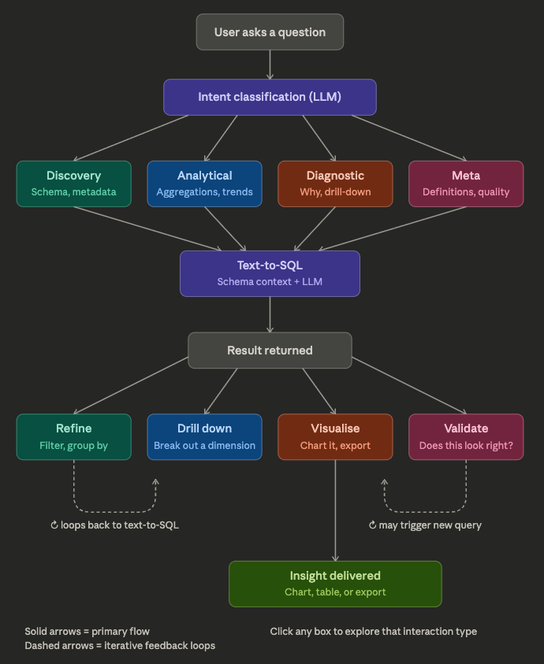

# LLM BI Chat — Interaction Taxonomy & Conversation Flows

---
The key interaction pattern is that these aren't isolated — they chain. A typical session flows like: Discovery → Descriptive → Diagnostic → Export, where each answer triggers a follow-up in a different category.



---

## Interaction Types

A user's first message almost always falls into one of six buckets.

### 1. Point Query
A single number or list — the simplest form.

> "How many orders last month?"
> "What's our gross margin for Q1?"
> "Who are the top 5 customers by revenue?"

**Result:** a number, a short table, or a sentence.
**Likely next step:** drill-down or visualize.

---

### 2. Trend / Time-Series
The user wants to see how something changes over time.

> "Show me monthly revenue for the last year"
> "Is our average order value growing or shrinking?"
> "How have returns trended since January?"

**Result:** a table with a time axis.
**Likely next step:** visualize as a line or area chart.

---

### 3. Comparison
Pitting two or more things against each other.

> "Which channel — web vs retail vs wholesale — has the highest margin?"
> "Compare this quarter to the same quarter last year"
> "How does category A perform vs category B?"

**Result:** a side-by-side table or grouped numbers.
**Likely next step:** visualize as a bar chart or drill into the losing side.

---

### 4. Ranking / Top-N
Sorting to find the best, worst, or most notable.

> "Top 10 products by net sales"
> "Which style codes have the worst return rate?"
> "What are the slowest-moving items this season?"

**Result:** an ordered table.
**Likely next step:** drill down into a specific row, or reformat as a chart.

---

### 5. Diagnostic / Why
The user already knows something is off and wants to understand why.

> "Why did sales drop in March?"
> "What's driving the decline in wholesale channel?"
> "Orders are up but revenue is flat — what's happening?"

**Result:** a decomposition of the problem — often multiple queries.
**Likely next step:** another drill-down, or export as a report.

---

### 6. Overview / Dashboard
The user wants the big picture, not a single answer.

> "Give me a summary of this month's performance"
> "Build a sales dashboard for the board meeting"
> "What does Q2 look like across all KPIs?"

**Result:** a full dashboard with KPI cards and multiple charts.
**Likely next step:** share / export, or drill into a specific KPI.

---

## Multi-Turn Conversation Patterns

A single question rarely ends a session. These are the common chains:

---

### Pattern A — Drill-Down Chain
Each answer reveals something worth investigating further.

```
"Revenue by channel"
  → "Show me just wholesale"
    → "Break wholesale down by country"
      → "Why is Germany underperforming?"
        → "Show me the specific orders from Germany"
```

**Trigger:** a number or row in the result looks interesting or unexpected.
**Interaction sequence:** Analytical → Analytical → Analytical → Diagnostic → Point

---

### Pattern B — Refinement Loop
The user keeps the same question but adjusts the scope.

```
"Top products by sales last quarter"
  → "Same but exclude clearance items"
    → "And just for the online channel"
      → "Show only items with margin > 40%"
```

**Trigger:** the first answer doesn't quite match what the user had in mind.
**Interaction sequence:** Ranking → Ranking → Ranking → Ranking
**What changes:** filters, date range, or exclusions, not the question type.

---

### Pattern C — Visualize and Reformat
Any result with a table naturally leads to a chart request.

```
"Net sales by month"
  → "Plot this as a line chart"
    → "Can you add a 3-month moving average?"
      → "Actually show it as a bar chart instead"
        → "Colour the bars by channel"
```

**Trigger:** a DataFrame result; user wants to see the shape of the data.
**Interaction sequence:** Trend → Chart → Reformat → Reformat → Reformat

---

### Pattern D — The Investigation Spiral
Classic diagnostic pattern: anomaly spotted → decompose → decompose further.

```
"Monthly revenue" (user notices a dip in February)
  → "Why is February revenue 20% down?"
    → "Which channels drove that drop?"
      → "Show me the wholesale orders in February"
        → "Flag any orders above £10k that were cancelled"
```

**Trigger:** an anomaly visible in a chart or table.
**Interaction sequence:** Trend → Diagnostic → Diagnostic → Point → Point
**Characteristic:** the question gets more specific with every turn.

---

### Pattern E — Report Assembly
The user is building toward a shareable output.

```
"Total sales, returns, and net margin for Q1"
  → "Add a breakdown by category"
    → "And a month-by-month trend"
      → "Show this as a full dashboard"
        → "Export it"
```

**Trigger:** a meeting, deadline, or need to share findings.
**Interaction sequence:** Point → Analytical → Trend → Dashboard → Export

---

### Pattern F — Hypothesis Testing
The user has a theory and wants the data to confirm or deny it.

```
"I think our margin is being hurt by free shipping on small orders"
  → "Average margin by order value band"
    → "Compare orders with free shipping vs paid shipping"
      → "Show the trend — has this got worse since we changed the threshold?"
```

**Trigger:** a business intuition the user wants to validate.
**Interaction sequence:** Diagnostic → Comparison → Comparison → Trend

---

## Interaction × Agent Mapping

How the above patterns map to the agents in this app:

| Interaction Type | Agent | Notes |
|---|---|---|
| Point Query | `QueryAgent` | Single SQL, returns a number or short table |
| Trend / Time-Series | `QueryAgent` | SQL with time aggregation; result usually triggers chart |
| Comparison | `QueryAgent` | SQL with GROUP BY or two separate queries |
| Ranking / Top-N | `QueryAgent` | SQL with ORDER BY + LIMIT |
| Diagnostic | `QueryAgent` | Often multiple SQL queries decomposing the problem |
| Overview / Dashboard | `VisualizationAgent` | Multiple SQL queries → KPI cards + charts |
| Visualize result | `ChartAgent` | Uses the DataFrame from the last QueryAgent run |
| Reformat chart | `ChartAgent` | Same DataFrame, new chart spec |

---

## What Drives Multi-Turn

Three things trigger a follow-up in practice:

1. **A number looks wrong or surprising** → drill-down or diagnostic
2. **A table has a shape worth seeing** → visualize
3. **An answer is almost right** → refinement (different filter, date, or scope)

The first answer almost never ends the conversation. A well-designed BI chat
interface should anticipate the follow-up type and make it one click or one
short phrase away.

---

## Relevance to Graph Design

The interaction taxonomy maps directly to the LangGraph routing decisions:

| User says | `router_node` returns | Graph routes to |
|---|---|---|
| Any data question | `query` | `query_agent` |
| "Dashboard", "overview", "report" | `visualization` | `visualization_agent` |
| "Plot this", "chart", "visualize" | `chart` | `chart_agent` |
| "Show as pie", "switch to bar", "colour by" | `reformat` | `chart_agent` (with existing df) |

Multi-turn patterns are handled by:
- **Drill-down / refinement** → new invoke to `router` each time (treated as a new query)
- **Reformat loop** → repeated `chart_agent` runs with `chart_history` accumulating
- **Investigation spiral** → alternating `query_agent` and `router → query_agent` runs
- **Clarifying questions inside chart_agent** → `interrupt()` pauses graph mid-node

---

## Known Gaps (as of current implementation)

### Gap 1 — QueryAgent has no conversation memory ⚠️ High

Patterns A (drill-down) and B (refinement) both rely on follow-up messages like:

> "Show me just wholesale"
> "Same but exclude returns"
> "Break that down by country"

These **silently fail today**. `QueryAgent` receives only the current message —
it has no awareness of what "just wholesale" or "same" refers to from a prior
answer. The user must re-state full context on every turn.

**Fix:** pass the full conversation history (`BIState.messages`) to
`query_agent_node` so the agent can resolve context-dependent phrases.
Tracked as a Phase 2 amendment.

---

### Gap 2 — Diagnostic queries get a single SQL pass ⚠️ Medium

Pattern D (investigation spiral) and Pattern F (hypothesis testing) often need
3–4 SQL queries to decompose a problem. The current `QueryAgent` system prompt
says *"Write a precise DuckDB SELECT query"* — singular. A question like "why
did sales drop in March?" will get one answer from one query rather than a
proper multi-dimensional breakdown.

**Fix:** update the `QueryAgent` prompt to allow multiple sequential SQL calls
when the question is diagnostic in nature. The underlying `run_tool_loop` already
supports this — it's purely a prompt change.
Tracked as a Phase 2 amendment.

---

### Gap 3 — Chart history accumulates across conversations ⚠️ Medium

In Pattern C (visualize and reformat), `chart_history` should reset whenever
the user starts a new data query. Currently it uses an append-only reducer
(`operator.add`), so a reformat request after a new query will include chart
history from the previous conversation, corrupting ChartAgent's context.

**Fix:** change `chart_history` to a plain field; `query_agent_node` resets it
to `[]` when a new DataFrame is written.
Tracked as a Phase 3 fix.
