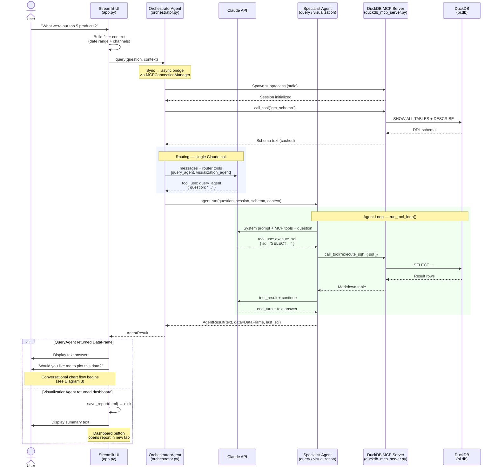
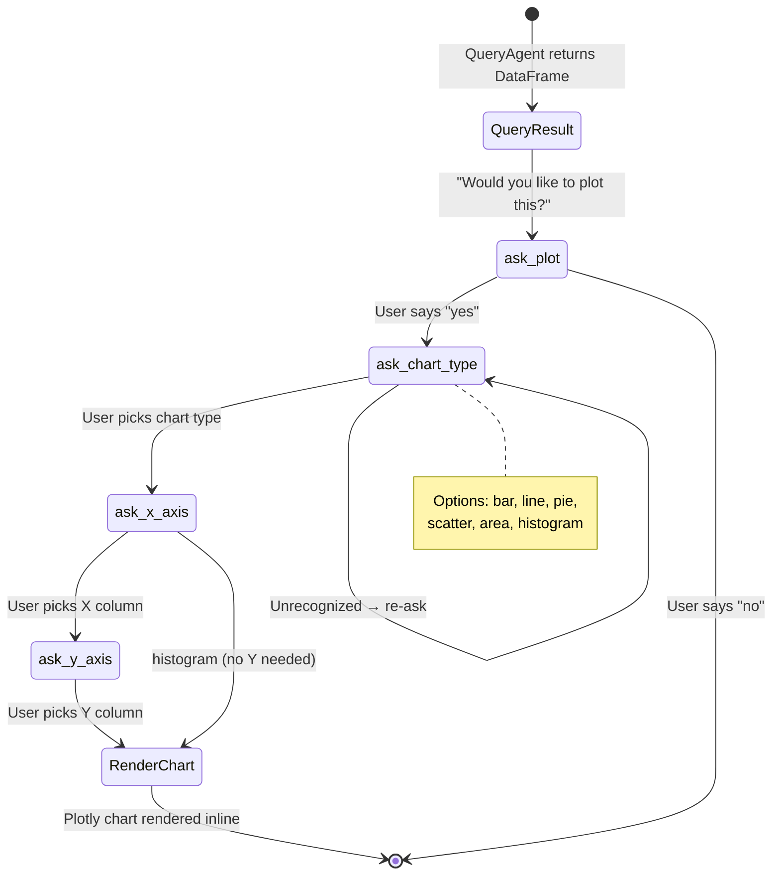
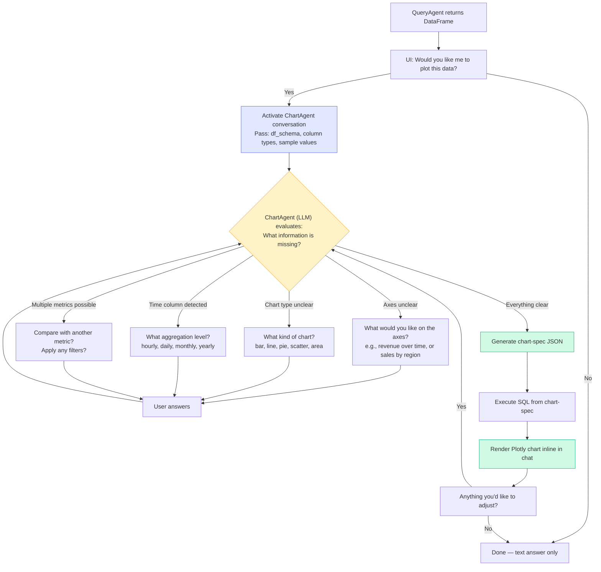
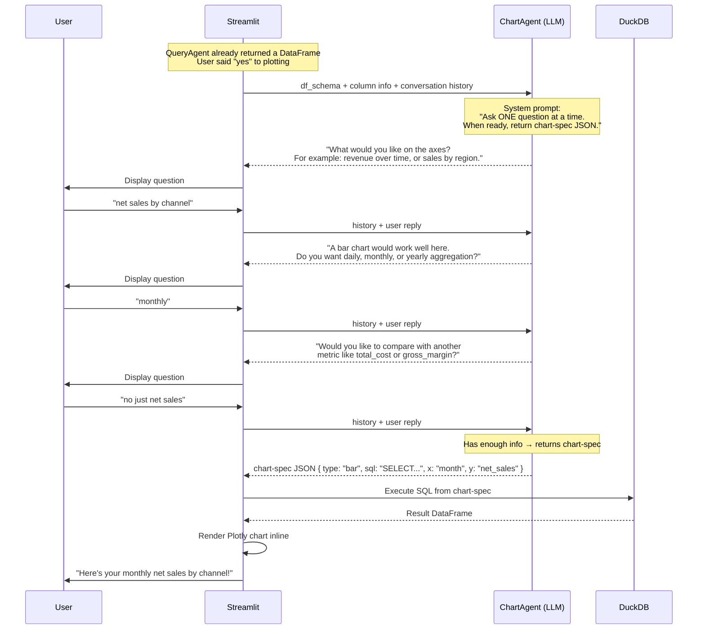
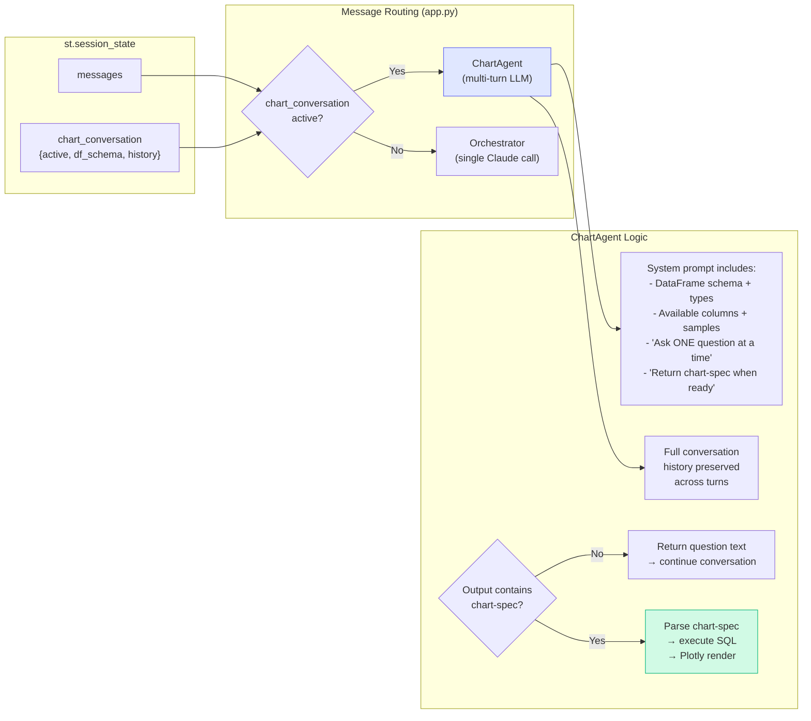
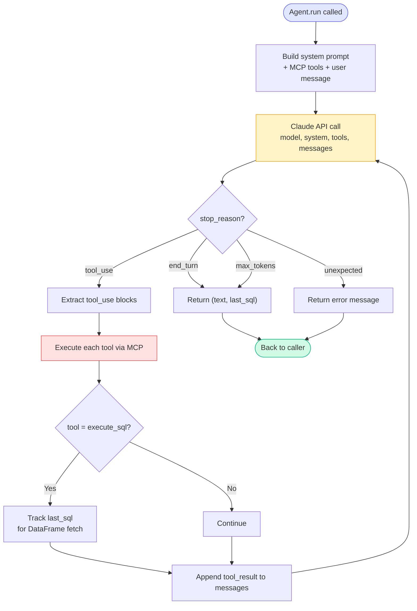
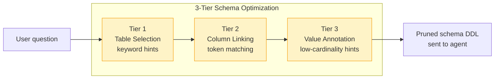

# Architecture Diagrams

## 1. Agent Routing — Sequence Diagram

Shows the full lifecycle of a user question, from chat input through orchestrator routing to specialist agent execution and back.



## 2. Chat Interaction — Current Charting State Machine

The current implementation uses a step-by-step state machine to gather chart parameters from the user.



## 3. Proposed Pattern: LLM-Driven Conversational Chart Generation

Instead of a rigid state machine with fixed steps, the **LLM itself decides what questions to ask** based on the user's input and the DataFrame schema. The questions are context-aware and adaptive.

### Why LLM-Driven?

The current state machine always asks the same 4 questions in the same order, regardless of context. But:
- _"Plot net sales by channel as a bar chart"_ — needs **zero** clarifications
- _"Show me a chart"_ — needs to know axes, chart type, aggregation
- _"Revenue over time"_ — needs aggregation level (daily/monthly/yearly) but chart type is obvious (line)

The LLM evaluates what's **already known** vs **what's missing** and asks only what's needed.

### Conversation Flow



### Multi-Turn Sequence



### Implementation Architecture



### ChartAgent System Prompt (Conceptual)

The ChartAgent receives a system prompt like:

```
You are a chart-building assistant helping the user visualize data.

Available DataFrame:
  Columns: channel (VARCHAR), created_date (DATE), net_sales (FLOAT), total_cost (FLOAT)
  Sample values: channel = ['Shopify-UK', 'Amazon', 'TikTok'], ...
  Row count: 847

Your job:
1. Understand what the user wants to visualize
2. Ask ONE clarifying question at a time (only if needed)
3. Consider asking about:
   - What should be on the axes (if unclear from context)
   - What chart type (if not already stated or obvious)
   - Time aggregation level (if a date column is involved)
   - Comparisons or filters (if multiple metrics exist)
4. When you have enough info, return a ```chart-spec JSON block:

{
  "chart_type": "bar|line|pie|scatter|area|histogram",
  "title": "Chart title",
  "x_column": "column_name",
  "y_column": "column_name",
  "x_label": "Human-readable X label",
  "y_label": "Human-readable Y label",
  "sql": "SELECT ... (optional: if aggregation/transform needed)"
}

IMPORTANT: If the user's request is specific enough, skip unnecessary questions
and go straight to chart-spec. Don't ask 4 questions when 1 will do.
```

### Key Differences: State Machine vs LLM-Driven

| Aspect | Current State Machine | LLM-Driven Pattern |
|--------|----------------------|-------------------|
| **Question order** | Fixed: plot? → type → X → Y | Adaptive: LLM decides based on context |
| **# of questions** | Always 3-4 | 0-4 depending on clarity of request |
| **Context awareness** | None — always asks everything | Skips questions when answers are obvious |
| **Aggregation** | Not asked | Asked when time columns detected |
| **Comparisons** | Not supported | LLM can suggest comparing metrics |
| **Error recovery** | Rigid retry on same step | Natural conversation, LLM adapts |
| **Extensibility** | Add new steps = change code | Change prompt = change behavior |

## 4. Agent Loop Detail — `run_tool_loop()`

Shows the inner loop that both QueryAgent and VisualizationAgent share.



## 5. Dashboard Rendering Pipeline

```mermaid
flowchart LR
    A[VisualizationAgent<br/>run_tool_loop] -->|"Claude returns<br/>```dashboard-data block"| B[parse_dashboard_response]
    B -->|regex extract JSON| C[render_dashboard]
    C -->|"replace placeholders:<br/>__TITLE__<br/>__DASHBOARD_JSON__<br/>__PALETTE_JSON__<br/>__CHARTJS__"| D["_DASHBOARD_TEMPLATE<br/>(self-contained HTML)"]
    D --> E[save_report]
    E -->|"report_&lt;ts&gt;.html"| F["src/static/reports/"]
    F --> G["📋 Dashboard button<br/>opens in new tab"]

    style A fill:#e0e7ff,stroke:#6366f1
    style D fill:#fef3c7,stroke:#f59e0b
    style G fill:#d1fae5,stroke:#10b981
```



## 6. Schema Pruning Pipeline


