# Architecture Diagrams

---

## Groups

| Group | Diagrams |
|-------|----------|
| **Architecture Overview** | 1 — Graph Topology · 2 — End-to-End Request Flow |
| **Phase 3: Human-in-the-Loop** | 3 — interrupt() Flow · 4 — LLM-Driven Chart |
| **Internal Mechanics** | 5 — Agent Loop · 6 — Dashboard Rendering · 7 — Schema Pruning |
| **Phase 6: Scale & Operations** | 8 — Deployment Architecture · 9 — Caching Strategy · 10 — Model Tier Split · 11 — Checkpointer Evolution |
| **Legacy Reference** | 12 — Pre-LangGraph Agent Routing · 13 — Pre-LangGraph State Machine |

---

## 1. LangGraph Graph Topology

The target `StateGraph` structure. All routing decisions are expressed as conditional edges over pure functions — no if/elif chains in application code.

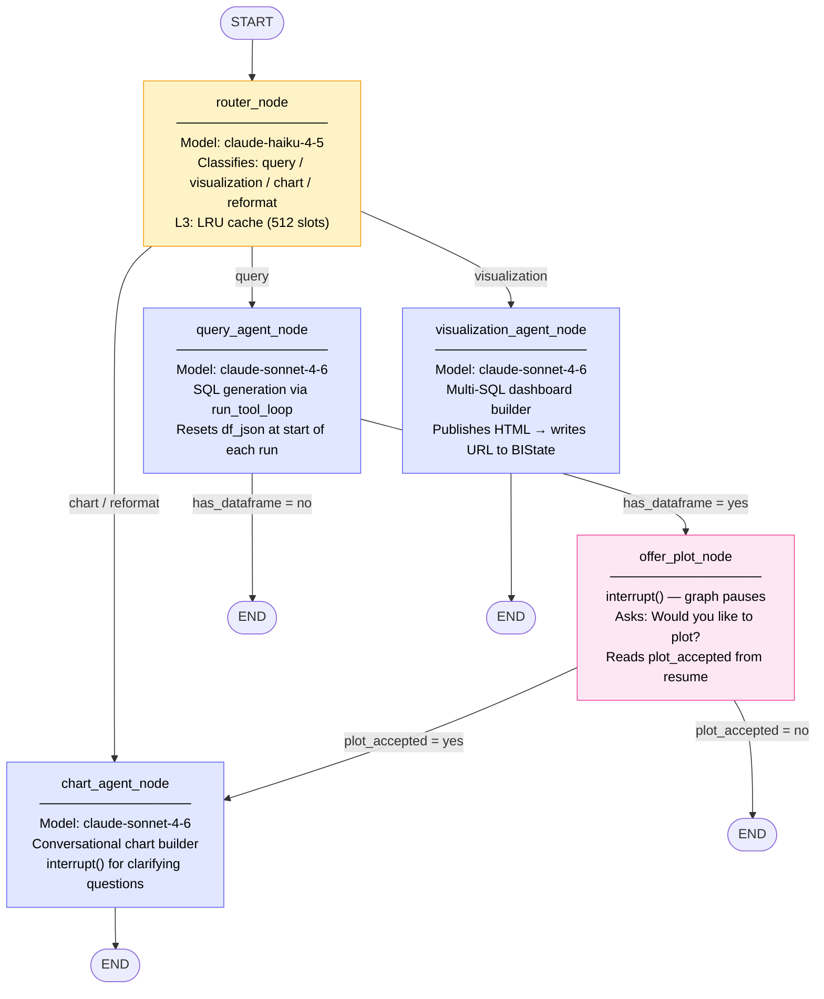

**Edge condition functions (pure, unit-testable):**

| Function | Reads | Returns |
|----------|-------|---------|
| `classify_intent(state)` | `state["intent"]` | `"query"` / `"visualization"` / `"chart"` / `"reformat"` |
| `has_dataframe(state)` | `state["df_json"]` | `"yes"` / `"no"` |
| `offer_plot_answer(state)` | `state["plot_accepted"]` | `"yes"` / `"no"` |

---

## 2. End-to-End Request Flow (Phase 6)

Complete sequence for a SQL query request in the Phase 6 multi-worker deployment. Shows how all layers — routing, caching, agents, DuckDB, checkpointing, and streaming — interact on a single user turn.

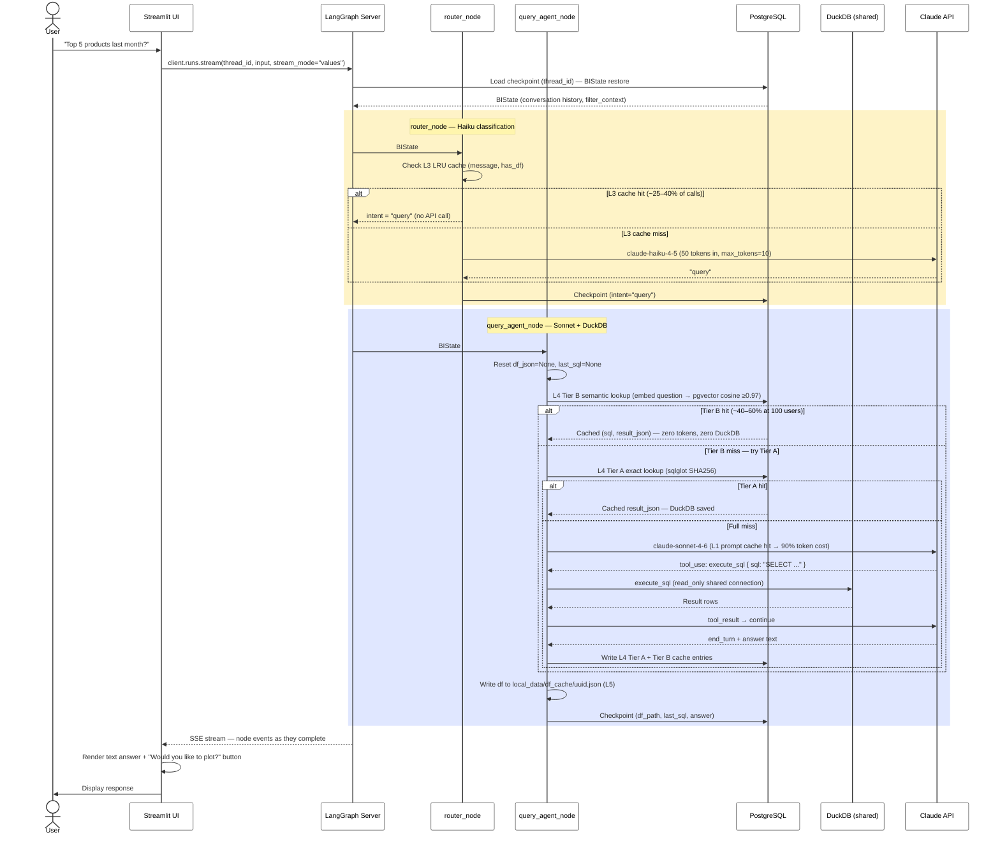

---

## 3. Phase 3: Human-in-the-Loop with interrupt()

LangGraph's `interrupt()` pauses the graph mid-execution and persists all state to the checkpointer. The UI resumes the graph on the next user message using `Command(resume=...)`.

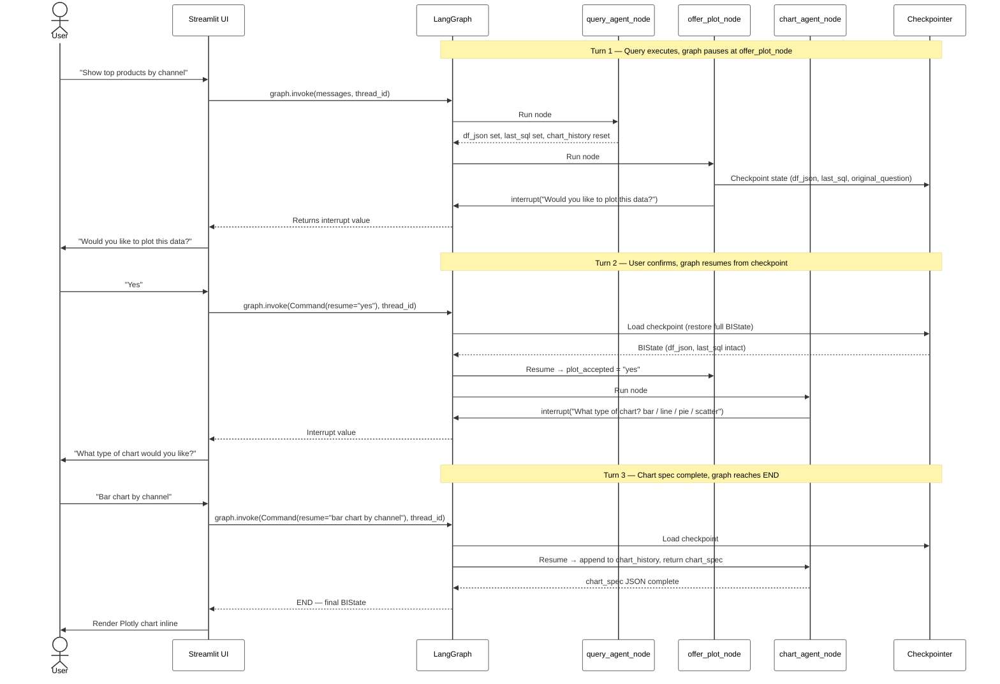

**State fields used by Phase 3:**

| Field | Written by | Read by |
|-------|-----------|---------|
| `df_json` | `query_agent_node` | `offer_plot_node`, `chart_agent_node` |
| `last_sql` | `query_agent_node` | `chart_agent_node` |
| `original_question` | `query_agent_node` | `chart_agent_node` |
| `db_schema` | `query_agent_node` | `chart_agent_node` |
| `plot_accepted` | `offer_plot_node` (via resume) | `offer_plot_answer()` edge |
| `chart_history` | `chart_agent_node` (reset by `query_agent_node`) | `chart_agent_node` |

---

## 4. LLM-Driven Conversational Chart Generation

Instead of a rigid state machine, the **LLM itself decides what questions to ask** based on the user's input and DataFrame schema. Implemented in Phase 3 as `chart_agent_node` using `interrupt()`.

### Why LLM-Driven?

The old state machine always asks the same 4 questions in the same order, regardless of context. But:
- _"Plot net sales by channel as a bar chart"_ — needs **zero** clarifications
- _"Show me a chart"_ — needs axes, chart type, aggregation
- _"Revenue over time"_ — needs aggregation level but chart type is obvious (line)

The LLM evaluates what's **already known** vs **what's missing** and asks only what's needed.

### Conversation Flow

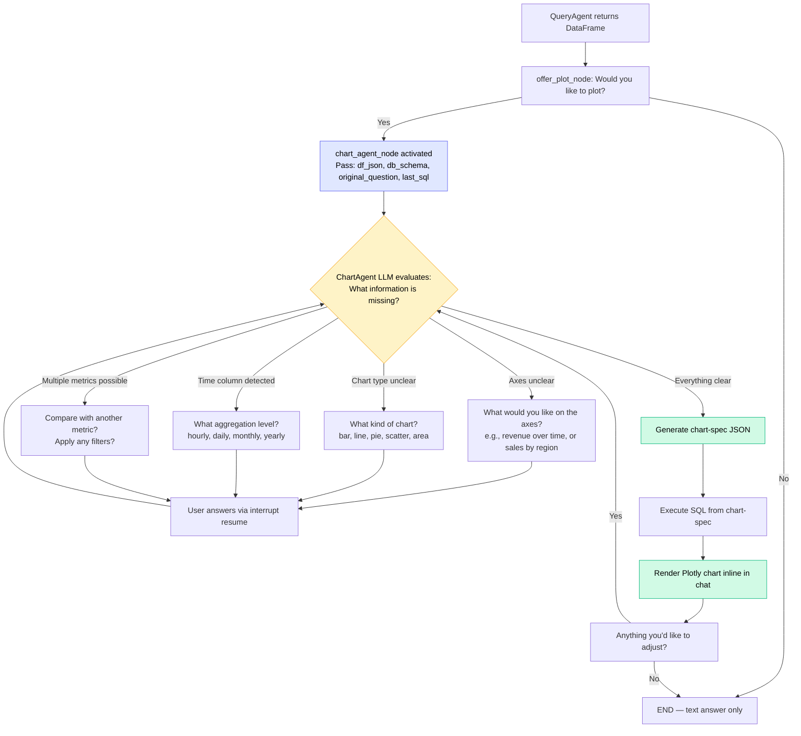

### Multi-Turn Sequence

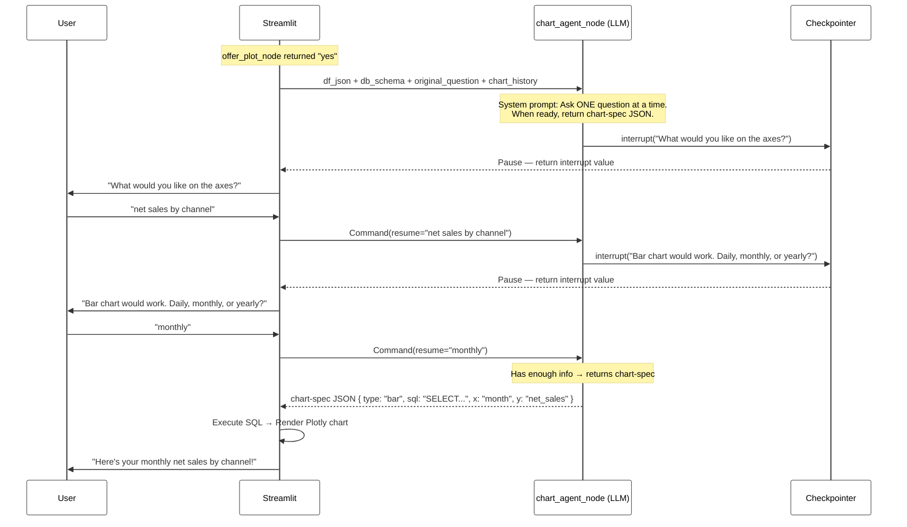

### Implementation Architecture (Phase 3+)

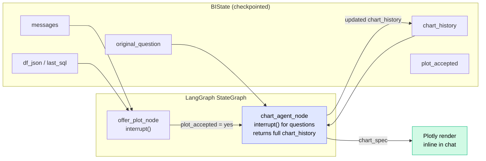

### Key Differences: State Machine vs LLM-Driven

| Aspect | Pre-LangGraph State Machine | Phase 3 LangGraph (chart_agent_node) |
|--------|----------------------------|--------------------------------------|
| **Question order** | Fixed: plot? → type → X → Y | Adaptive: LLM decides based on context |
| **# of questions** | Always 3–4 | 0–4 depending on clarity of request |
| **Context awareness** | None — always asks everything | Skips questions when answers are obvious |
| **Pause/resume** | Phase flag in `st.session_state` | `interrupt()` — native LangGraph |
| **State persistence** | Lost on browser refresh | Checkpointed to DB |
| **Extensibility** | Add new steps = change code | Change prompt = change behavior |

---

## 5. Agent Loop Detail — `run_tool_loop()`

The inner loop shared by `QueryAgent` and `VisualizationAgent`. In Phase 6, the `ExecTool` step calls direct DuckDB callables instead of MCP session methods.

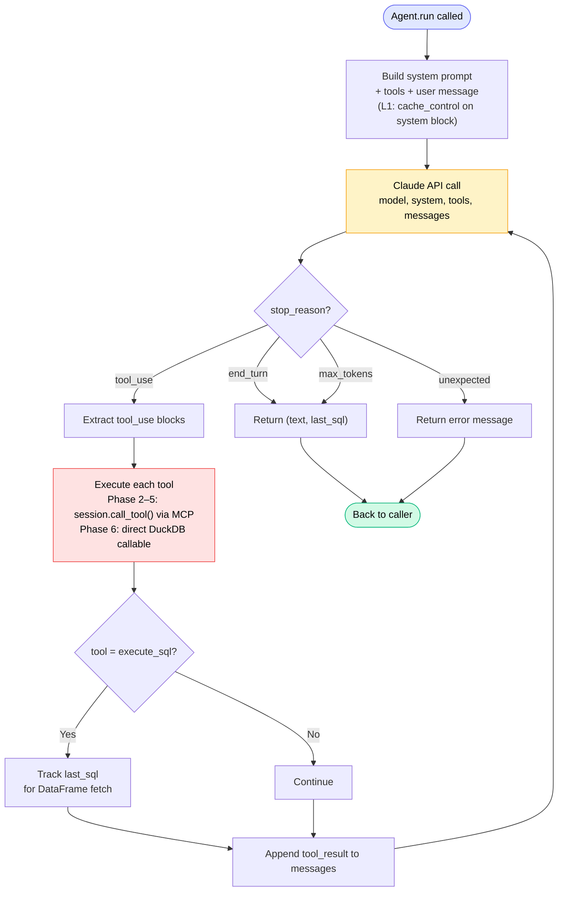

**Phase 6 migration note:** `run_tool_loop` currently calls `session.call_tool()` on the MCP `ClientSession`. The direct DuckDB migration (ADR-005) requires one of: (a) refactoring `run_tool_loop` to accept a callable dict, (b) a thin `ClientSession` adapter over direct DuckDB, or (c) two separate tool loops. See G9 in CLAUDE.md for the full gap analysis.

---

## 6. Dashboard Rendering Pipeline

```mermaid
flowchart LR
    A["VisualizationAgent<br/>run_tool_loop"] -->|"Claude returns<br/>dashboard-data block"| B[parse_dashboard_response]
    B -->|regex extract JSON| C[render_dashboard]
    C -->|"replace placeholders:<br/>__TITLE__<br/>__DASHBOARD_JSON__<br/>__PALETTE_JSON__<br/>__CHARTJS__"| D["_DASHBOARD_TEMPLATE<br/>(self-contained HTML)"]
    D --> E[save_report]
    E -->|"report_&lt;ts&gt;.html<br/>Phases 1–4: disk only"| F["src/static/reports/"]
    F --> G["Dashboard button<br/>opens in new tab"]

    D --> EP["Phase 5+: publish_report<br/>Push HTML to intranet / Power BI<br/>Return URL"]
    EP -->|"dashboard_url"| BIS["BIState.dashboard_url<br/>(URL only — not raw HTML)"]
    BIS --> G5["Phase 5+ button<br/>opens published URL"]

    style A fill:#e0e7ff,stroke:#6366f1,color:#000000
    style D fill:#fef3c7,stroke:#f59e0b,color:#000000
    style G fill:#d1fae5,stroke:#10b981,color:#000000
    style EP fill:#fce7f3,stroke:#ec4899,color:#000000
    style G5 fill:#d1fae5,stroke:#10b981,color:#000000
```

**Phase 5 note:** `visualization_agent_node` currently calls `save_report()` twice — once inside `VisualizationAgent.run()` and once in the node itself. Phase 5 consolidates this into a single `publish_report()` call that writes the URL directly to `BIState.dashboard_url`.

---

## 7. Schema Pruning Pipeline

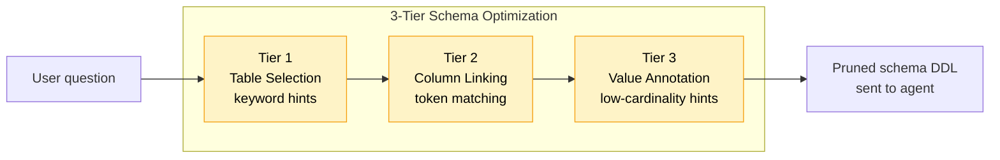

---

## 8. Phase 6: Deployment Architecture

LangGraph Server replaces Streamlit's single-process model. Streamlit becomes a thin HTTP client. Multiple async workers share a single PostgreSQL checkpointer and a read-only DuckDB file.

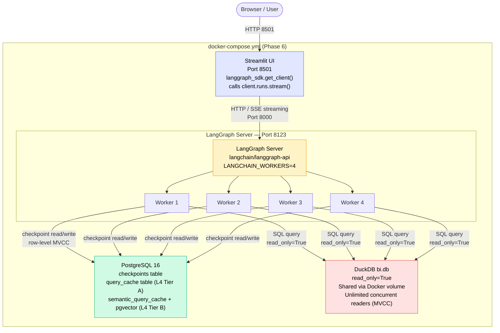

---

## 9. Multi-Layer Caching Strategy

Six cache layers activated across Phases 2.5–6. Layers are hit in order — earlier layers save more cost and latency.

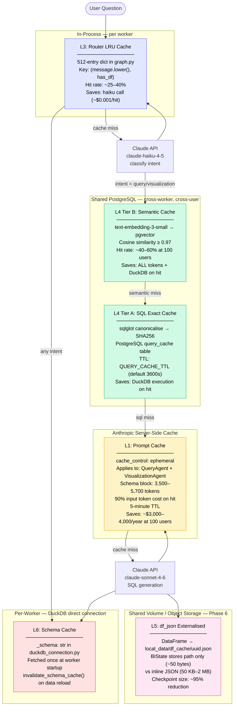

**Phase activation:**

| Layer | Activated | Scope |
|-------|-----------|-------|
| L1 Prompt cache | Phase 2.5 | Anthropic server-side |
| L2 Client singleton | Phase 2.5 | Per-process |
| L3 Router LRU | Phase 2.5 | Per-process |
| L4 SQL cache | Phase 5 (in-process TTL) → Phase 6 (PostgreSQL) | Phase 6: cross-worker |
| L5 df_json file | Phase 5 (local disk) → Phase 6 (shared volume) | Phase 6: cross-worker |
| L6 Schema cache | Phase 6 | Per-worker (acceptable) |

---

## 10. Model Tier Split

Every user turn makes two Claude API calls. ADR-009 routes each to the appropriate model based on task complexity.

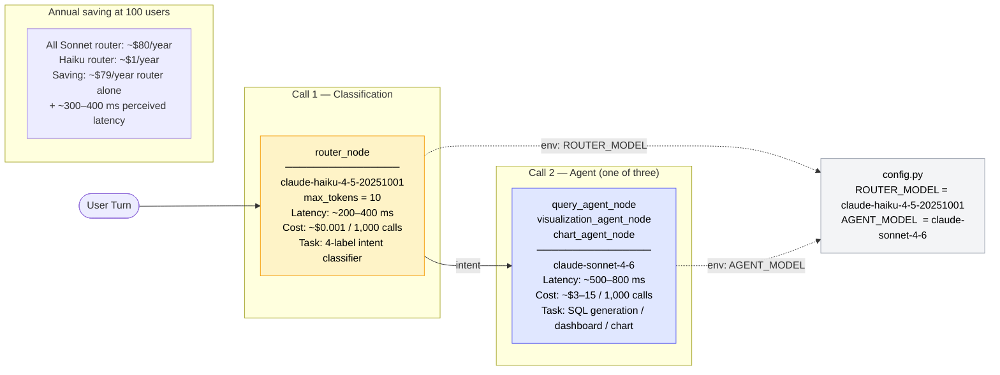

---

## 11. Checkpointer Evolution

The checkpointer progresses through three implementations. The interface is identical across all three — only the connection string and import change.

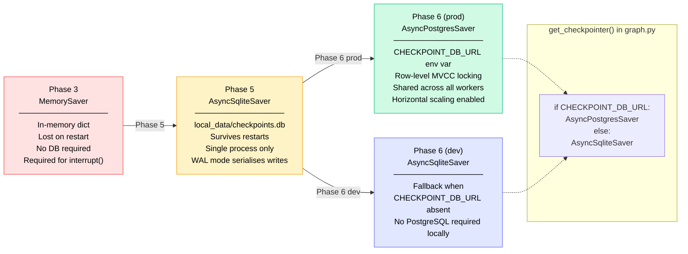

---

## 12. Pre-LangGraph: Agent Routing (Legacy)

> **Note:** This diagram shows the **pre-migration architecture** (the hand-built orchestrator in `llm-bi-chat-agentic`). The `OrchestratorAgent` and `AgentRegistry` are replaced by the LangGraph `StateGraph` (see Diagram 1). Kept here as a reference for the migration delta.

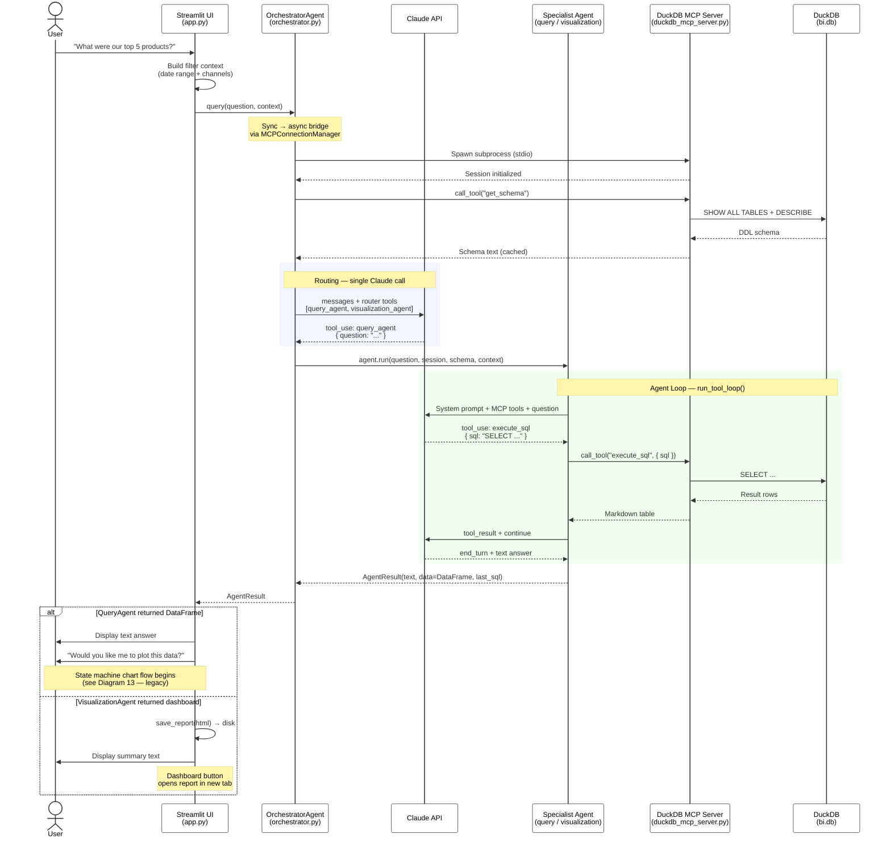

---

## 13. Pre-LangGraph: Charting State Machine (Legacy)

> **Note:** This is the **pre-Phase 3 implementation**. Phase 3 replaces this rigid state machine with `chart_agent_node` + `interrupt()` (see Diagrams 3 and 4). Kept here as a reference for the migration delta.

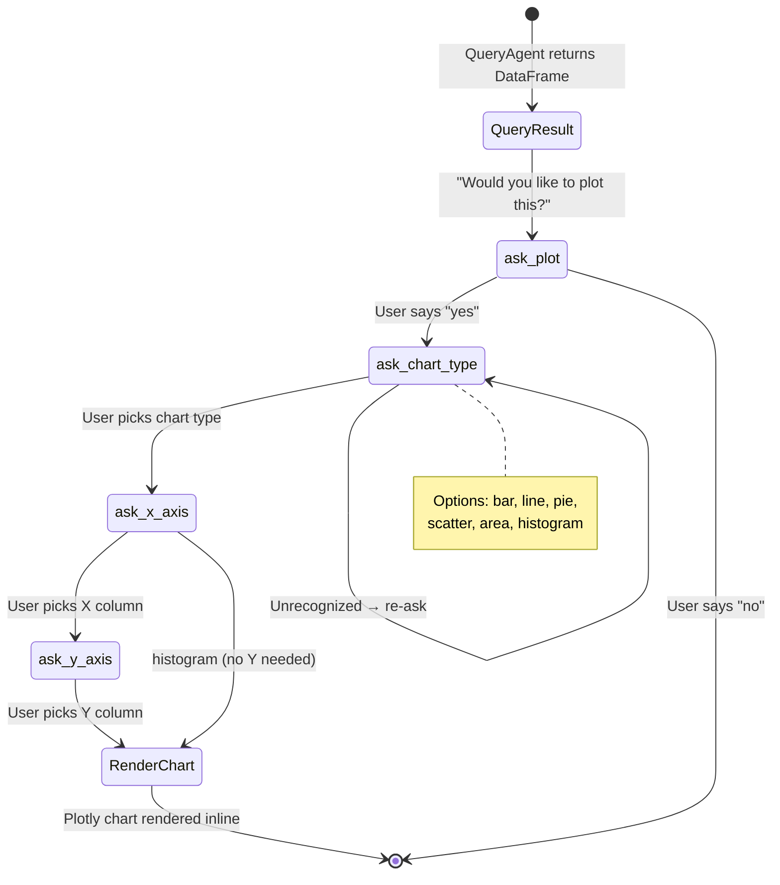
